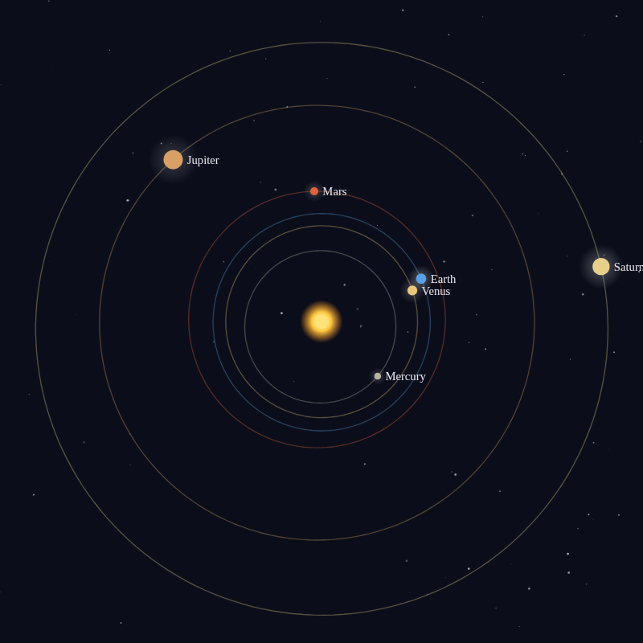

# Music-of-the-Spheres

Hear the planets sing. A live orrery moves the planets on their real orbits, starting from today, and gives each one a voice that rises as it speeds up near the Sun and falls as it slows down far from it, the way Johannes Kepler imagined in *Harmonices Mundi* (1619). No sign-up and no libraries.

- [Listen to the planets](https://evoluteur.github.io/music-of-the-spheres/)

## What it does

- **Listen**: press **Listen** and the planets sing together, each sliding over its own interval once per orbit. Pause or speed up time (from a day to 20 years per second), change the volume, and pick a timbre (pure, organ or soft).
- **The choir**: each planet's current note, in Hz and as the nearest note name, and where it is between its slowest (aphelion) and fastest (perihelion).
- **Planets**: Kepler's six, plus Uranus and Neptune if you like.
- **View**: a compressed or a true distance scale, planet names, perihelion and aphelion.
- **Kepler's intervals**: a table of the ratio between each planet's fastest and slowest speed, the nearest musical interval, and the interval Kepler heard.

## How the sound works

A planet's angular speed around the Sun, and so its pitch, is proportional to (1 + e cos ν)², where e is the eccentricity of the orbit and ν the planet's angle from perihelion. The real speeds are far too slow to hear, so each planet is moved up by whole octaves into its own register, as Kepler did: that keeps its interval exact while putting Saturn in the bass and Mercury in the treble. Orbital elements are from NASA JPL's [Approximate Positions of the Planets](https://ssd.jpl.nasa.gov/planets/approx_pos.html); the tilt of the orbits is ignored.

## How it is built

The pages are plain HTML, CSS and JavaScript, with no dependencies and no build step. Just open `index.html`. The sound is made with the Web Audio API. It is also a small installable web app: add it to your home screen or desktop and it works offline.

- The planet data is in [js/spheres-data.js](https://github.com/evoluteur/music-of-the-spheres/blob/main/js/spheres-data.js), and the orbits, drawing and sound are in [js/spheres.js](https://github.com/evoluteur/music-of-the-spheres/blob/main/js/spheres.js).
- Three color themes (dark, light and blue) are shared with my other projects.
- Your settings are kept in the browser's local storage.

Music-of-the-Spheres is open source at [GitHub](https://github.com/evoluteur/music-of-the-spheres) with MIT license.

Had fun browsing the app? [Buy me a coffee by becoming a sponsor](https://github.com/sponsors/evoluteur).

You may also be interested in my other sound projects [Healing-Frequencies](https://github.com/evoluteur/healing-frequencies) ([demo](https://evoluteur.github.io/healing-frequencies/)) and [Tibetan-Singing-Bowls](https://github.com/evoluteur/tibetan-singing-bowls) ([demo](https://evoluteur.github.io/tibetan-singing-bowls/)). For more mystic arts as small web apps, see [Esoterica](https://evoluteur.github.io/esoterica.html).

Copyright (c) 2026 [Olivier Giulieri](https://evoluteur.github.io/).
